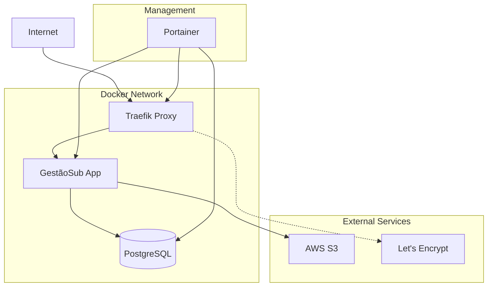
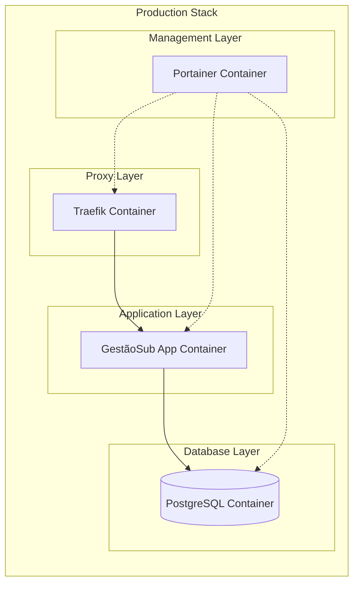

# Design Document - Production Deployment

## Overview

Este documento detalha o design da arquitetura de produção para o sistema GestãoSub, incluindo a migração completa para PostgreSQL, containerização com Docker, e configuração de infraestrutura com Traefik e Portainer. A solução visa criar um ambiente de produção robusto, escalável e facilmente gerenciável.

## Architecture

### High-Level Architecture



### Container Architecture



## Components and Interfaces

### 1. Database Migration (PostgreSQL)

**Componente:** Database Configuration
- **Responsabilidade:** Configurar conexão PostgreSQL e remover dependências MySQL
- **Interface:** Drizzle ORM com PostgreSQL driver
- **Configuração:**
  - Driver: `postgres` (já configurado)
  - Pool de conexões otimizado para produção
  - SSL habilitado para conexões seguras
  - Backup automático configurado

### 2. Application Container

**Componente:** Docker Container
- **Base Image:** Node.js 20 Alpine (otimizada)
- **Multi-stage Build:**
  - Stage 1: Build (instalar deps, compilar TypeScript, build Vite)
  - Stage 2: Runtime (apenas arquivos necessários)
- **Otimizações:**
  - Usar .dockerignore para reduzir contexto
  - Instalar apenas dependências de produção
  - Configurar usuário não-root
  - Health checks configurados

### 3. Proxy Reverso (Traefik)

**Componente:** Traefik Configuration
- **Responsabilidades:**
  - SSL/TLS automático via Let's Encrypt
  - Roteamento baseado em domínio
  - Rate limiting e segurança
  - Headers de segurança
- **Configuração:**
  - Certificados automáticos
  - Redirecionamento HTTP → HTTPS
  - Middlewares de segurança
  - Dashboard protegido

### 4. Orchestration (Docker Compose)

**Componente:** Service Orchestration
- **Serviços:**
  - `app`: Aplicação GestãoSub
  - `db`: PostgreSQL com persistência
  - `traefik`: Proxy reverso
- **Redes:**
  - `web`: Rede externa para Traefik
  - `internal`: Rede interna para app-db
- **Volumes:**
  - Dados PostgreSQL persistentes
  - Certificados SSL
  - Logs da aplicação

### 5. Environment Configuration

**Componente:** Environment Management
- **Produção:**
  - Variáveis sensíveis via Docker secrets
  - Configurações otimizadas para performance
  - Logs estruturados (JSON)
  - Rate limiting habilitado
- **Segurança:**
  - JWT secrets fortes
  - CORS restritivo
  - Headers de segurança
  - SSL obrigatório

## Data Models

### Environment Variables Structure

```typescript
interface ProductionEnv {
  // Application
  NODE_ENV: 'production'
  PORT: number
  APP_URL: string
  
  // Database
  DATABASE_URL: string // PostgreSQL connection string
  DB_SSL: boolean
  DB_POOL_SIZE: number
  
  // Security
  JWT_SECRET: string
  COOKIE_SECRET: string
  CORS_ORIGIN: string
  
  // External Services
  AWS_ACCESS_KEY_ID?: string
  AWS_SECRET_ACCESS_KEY?: string
  AWS_REGION?: string
  AWS_S3_BUCKET?: string
  
  // Monitoring
  LOG_LEVEL: 'error' | 'warn' | 'info'
  ENABLE_REQUEST_LOGGING: boolean
  
  // Rate Limiting
  RATE_LIMIT_WINDOW_MS: number
  RATE_LIMIT_MAX_REQUESTS: number
}
```

### Docker Compose Structure

```yaml
version: '3.8'

services:
  traefik:
    image: traefik:v3.0
    networks:
      - web
    ports:
      - "80:80"
      - "443:443"
    volumes:
      - /var/run/docker.sock:/var/run/docker.sock
      - ./traefik:/etc/traefik
      - ./certs:/certs
    labels:
      - "traefik.enable=true"
      - "traefik.http.routers.dashboard.rule=Host(`traefik.yourdomain.com`)"
      - "traefik.http.routers.dashboard.tls.certresolver=letsencrypt"

  app:
    build: .
    networks:
      - web
      - internal
    environment:
      - NODE_ENV=production
      - DATABASE_URL=postgresql://user:pass@db:5432/gestaosub
    labels:
      - "traefik.enable=true"
      - "traefik.http.routers.app.rule=Host(`yourdomain.com`)"
      - "traefik.http.routers.app.tls.certresolver=letsencrypt"
    depends_on:
      - db

  db:
    image: postgres:16-alpine
    networks:
      - internal
    environment:
      - POSTGRES_DB=gestaosub
      - POSTGRES_USER=gestaosub_user
      - POSTGRES_PASSWORD_FILE=/run/secrets/db_password
    volumes:
      - postgres_data:/var/lib/postgresql/data
    secrets:
      - db_password

  app:
    build: .
    networks:
      - web
      - internal
    environment:
      - NODE_ENV=production
      - DATABASE_URL=postgresql://gestaosub_user:${DB_PASSWORD}@db:5432/gestaosub?sslmode=require
      - CORS_ORIGIN=https://yourdomain.com
      - ENABLE_SECURITY_HEADERS=true
      - ENABLE_COMPRESSION=true
    secrets:
      - db_password
      - jwt_secret
      - cookie_secret
      - aws_access_key_id
      - aws_secret_access_key
      - smtp_user
      - smtp_pass
      - google_client_secret
      - openai_api_key
    labels:
      - "traefik.enable=true"
      - "traefik.http.routers.app.rule=Host(`yourdomain.com`)"
      - "traefik.http.routers.app.tls.certresolver=letsencrypt"
      - "traefik.http.middlewares.security-headers.headers.customrequestheaders.X-Forwarded-Proto=https"
      - "traefik.http.middlewares.security-headers.headers.sslredirect=true"
      - "traefik.http.routers.app.middlewares=security-headers"
    depends_on:
      - db

networks:
  web:
    external: true
  internal:
    external: false

volumes:
  postgres_data:

secrets:
  db_password:
    file: ./secrets/db_password.txt
  jwt_secret:
    file: ./secrets/jwt_secret.txt
  cookie_secret:
    file: ./secrets/cookie_secret.txt
  aws_access_key_id:
    file: ./secrets/aws_access_key_id.txt
  aws_secret_access_key:
    file: ./secrets/aws_secret_access_key.txt
  smtp_user:
    file: ./secrets/smtp_user.txt
  smtp_pass:
    file: ./secrets/smtp_pass.txt
  google_client_secret:
    file: ./secrets/google_client_secret.txt
  openai_api_key:
    file: ./secrets/openai_api_key.txt
```

## Error Handling

### Application Level

1. **Database Connection Errors**
   - Retry logic com backoff exponencial
   - Health checks para verificar conectividade
   - Graceful shutdown em caso de falha persistente

2. **Container Health Checks**
   - Endpoint `/health` para verificar status
   - Verificação de conectividade com banco
   - Restart automático em caso de falha

3. **Proxy Errors**
   - Páginas de erro customizadas
   - Fallback para manutenção
   - Rate limiting com mensagens apropriadas

### Infrastructure Level

1. **SSL Certificate Issues**
   - Renovação automática via Let's Encrypt
   - Fallback para certificados manuais
   - Alertas em caso de expiração próxima

2. **Resource Monitoring**
   - Limites de CPU e memória
   - Alertas de uso excessivo
   - Auto-scaling quando necessário

## Testing Strategy

### 1. Container Testing

```bash
# Build e test da imagem
docker build -t gestaosub:test .
docker run --rm gestaosub:test npm test

# Test de integração com PostgreSQL
docker-compose -f docker-compose.test.yml up --abort-on-container-exit
```

### 2. Database Migration Testing

```bash
# Test de migração em ambiente limpo
docker run --rm postgres:16-alpine
npm run db:push
npm run test:db
```

### 3. Security Testing

```bash
# Test de headers de segurança
curl -I https://yourdomain.com
# Verificar SSL
openssl s_client -connect yourdomain.com:443
# Test de rate limiting
ab -n 1000 -c 10 https://yourdomain.com/api/health
```

### 4. Performance Testing

```bash
# Load testing
k6 run performance-test.js
# Database performance
pgbench -c 10 -j 2 -t 1000 gestaosub
```

### 5. Backup and Recovery Testing

```bash
# Test de backup
pg_dump gestaosub > backup.sql
# Test de restore
psql gestaosub < backup.sql
# Verificar integridade
npm run test:db:integrity
```

## Security Considerations

### 1. Network Security

- Rede interna isolada para comunicação app-db
- Traefik como único ponto de entrada
- Firewall configurado para portas específicas

### 2. Application Security

- Headers de segurança (HSTS, CSP, X-Frame-Options)
- Rate limiting por IP e endpoint
- CORS restritivo para domínios autorizados
- Validação rigorosa de input

### 3. Data Security

- Conexões PostgreSQL com SSL
- Secrets gerenciados via Docker secrets
- Backup criptografado
- Logs sem informações sensíveis

### 4. Container Security

- Imagens base atualizadas
- Usuário não-root
- Filesystem read-only quando possível
- Scanning de vulnerabilidades

## Deployment Strategy

### 1. Blue-Green Deployment

```bash
# Deploy nova versão
docker-compose -f docker-compose.blue.yml up -d
# Test da nova versão
./scripts/health-check.sh blue
# Switch do tráfego
./scripts/switch-traffic.sh blue
# Cleanup da versão anterior
docker-compose -f docker-compose.green.yml down
```

### 2. Rolling Updates

- Atualização gradual dos containers
- Health checks antes de remover versão anterior
- Rollback automático em caso de falha

### 3. Database Migrations

- Migrations executadas antes do deploy da app
- Backup automático antes de migrations
- Rollback de schema em caso de falha

## Monitoring and Observability

### 1. Application Metrics

- Response time por endpoint
- Taxa de erro por status code
- Uso de CPU e memória
- Conexões ativas no banco

### 2. Infrastructure Metrics

- Status dos containers
- Uso de disco e rede
- Certificados SSL próximos do vencimento
- Backup status

### 3. Alerting

- Slack/Discord para alertas críticos
- Email para alertas de warning
- Dashboard para métricas em tempo real

### 4. Log Management

- Logs estruturados em JSON
- Rotação automática de logs
- Agregação via ELK stack (opcional)
- Retention policy configurada